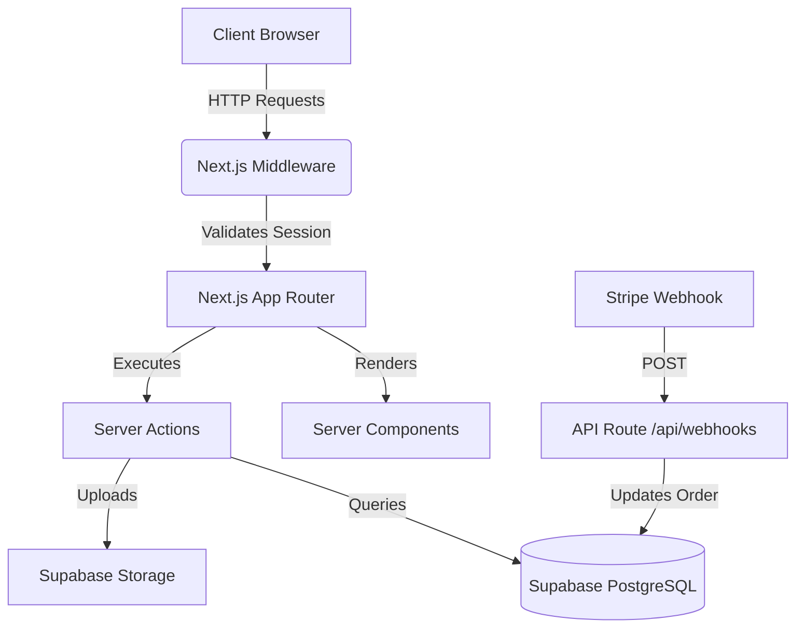
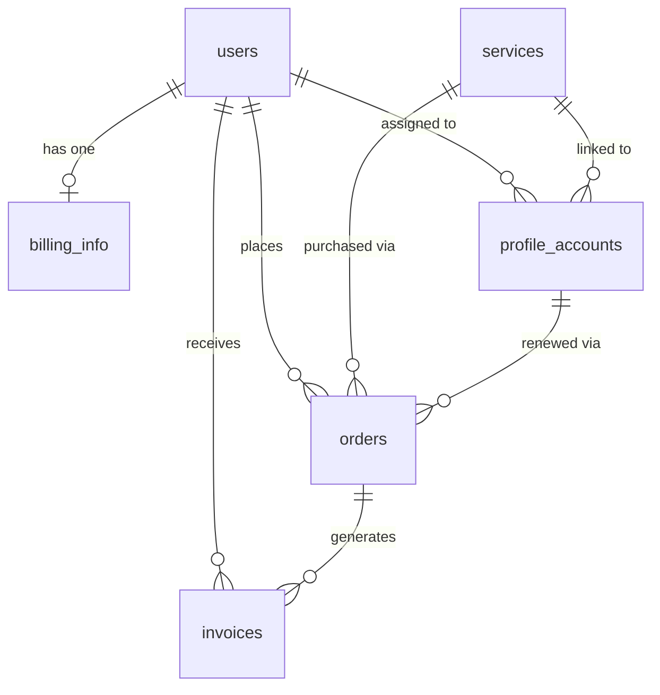

# BoostBuddy MVP

A modern, full-stack Next.js web application designed to manage client profiles, services, orders, and invoices. It features an integrated client and admin dashboard, Stripe checkout, Supabase authentication, and a scalable architecture optimized for high performance.

## Features

- **Next.js App Router Architecture**: Leverages Server Components and Server Actions for fast, secure data fetching and mutations.
- **Role-Based Authentication**: Secure authentication via Supabase with distinct `ADMIN` and `CLIENT` user roles and protected routes.
- **Stripe Integration**: Automated checkout, payment processing, and webhooks for real-time order fulfillment.
- **Invoice Management**: Admin panel allows secure uploading of PDF invoices linked directly to client orders via Supabase Storage.
- **Internationalization (i18n)**: Multi-language support implemented using `react-i18next`.
- **Telegram Notifications**: Real-time notifications dispatched to global admin channels and individual client chat IDs.
- **Modern UI/UX**: Built with Tailwind CSS, Shadcn UI components, and SweetAlert2 for beautiful, responsive interactions and instant optimistic UI updates.

---

# Tech Stack

| Technology | Version | Purpose |
|------------|---------|---------|
| **Next.js** | 16.2.9 | Core React Framework (App Router, Server Actions) |
| **React** | 19.2.4 | UI Component Library |
| **TypeScript** | 5.x | Static Typing for robust code quality |
| **Supabase** | ^0.12.0 | Authentication (`@supabase/ssr`) and PostgreSQL DB |
| **TailwindCSS** | 4.3.1 | Utility-first CSS styling framework |
| **Shadcn UI** | (varied) | Accessible, reusable UI component foundation |
| **Stripe** | ^22.2.1 | Payment Gateway for checkouts and webhooks |
| **SweetAlert2**| ^11.26.25 | Beautiful, animated confirmation dialogs |
| **i18next** | ^26.3.2 | Internationalization (i18n) framework |
| **Prisma** | ^7.8.0 | *Legacy data modeling tool (Now using native Supabase)* |

---

# Architecture Overview

The application follows a modern Next.js Serverless Architecture:

- **Overall Architecture**: The project uses the Next.js App Router. UI components are a mix of Server Components (for fast initial loads and SEO) and Client Components (for interactivity).
- **Data Flow**: Instead of traditional API routes, the app uses **Server Actions** (`/app/actions`) to mutate data securely on the server. Data is fetched directly from Supabase via `@supabase/supabase-js`.
- **Authentication Flow**: `@supabase/ssr` handles cookie-based sessions. Authentication state is tracked globally via `AuthContext`.
- **API Flow**: Only required external webhooks (like Stripe) and specific session management routes (Logout) utilize Next.js API Routes (`/app/api`).
- **Server vs Client Components**: Layouts and complex data views are rendered on the server. Interactive elements (like buttons, modals, forms) are marked with `"use client"`.



---

# Folder Structure

```text
/
├── app/                  # Next.js App Router (Pages, Layouts, Server Actions)
│   ├── actions/          # Next.js Server Actions (Database mutations)
│   ├── admin/            # Admin Dashboard (Profiles, Orders, Services)
│   ├── api/              # API Routes (Stripe Webhooks, Logout)
│   ├── auth/             # Supabase Auth Callbacks
│   └── dashboard/        # Client Dashboard (Payments, Invoices, Settings)
├── components/           # Shared React Components
│   ├── admin/            # Admin-specific components
│   ├── providers/        # Global context providers
│   └── ui/               # Shadcn UI generic components
├── context/              # React Context (AuthContext, ToastContext)
├── lib/                  # Utilities and Services
│   ├── auth/             # Auth helper functions
│   ├── stripe/           # Stripe server configuration
│   └── supabase/         # Supabase client, server, and middleware wrappers
├── prisma/               # Legacy SQLite database schema definition
└── public/               # Static assets
```

---

# Database

The application uses Supabase (PostgreSQL) as its primary database.

## Database Overview

| Table | Purpose | Primary Key | Foreign Keys |
|-------|---------|-------------|--------------|
| `users` | Stores core user accounts, roles, and status | `id` | - |
| `billing_info` | Stores billing address and tax codes | `id` | `userId` -> `users.id` |
| `services` | Available subscription services | `id` | - |
| `profile_accounts` | Client profiles (e.g., IXBrowser) assigned to users | `id` | `assignedClientId`, `serviceId` |
| `orders` | Stripe checkout sessions and purchases | `id` | `userId`, `serviceId`, `profileAccountId` |
| `invoices` | PDF invoices uploaded by admins for orders | `id` | `userId`, `orderId` |
| `notification_logs`| History of system notifications sent | `id` | - |
| `app_settings` | Global application configuration | `id` | - |



---

# Authentication

- **Login / Signup Flow**: Standard email/password authentication using Supabase.
- **Session Management**: Supabase tokens are persisted in HttpOnly cookies using `@supabase/ssr`.
- **Middleware**: `lib/supabase/middleware.ts` intercepts all requests. It redirects unauthenticated users away from `/dashboard` and restricts `/admin` routes exclusively to users with the `ADMIN` role.
- **Logout Flow**: Utilizes a highly optimized optimistic logout flow. The UI clears instantly on the client side, while the session is destroyed via a background API call to `/api/logout`.

---

# Supabase

- **Auth**: Manages user identities and JWTs.
- **Database**: Direct PostgreSQL access for Server Actions.
- **Storage**: Uses an `invoices` bucket. Admins have upload/delete permissions, while authenticated clients have read access to their own invoices.
- **Realtime / Edge Functions**: *Not found in repository.*
- **SQL Migrations**: Schema managed natively in Supabase dashboard. *(Local migration files not found in repo).*

---

# Environment Variables

| Variable | Required | Description |
|---|---|---|
| `NEXT_PUBLIC_SUPABASE_URL` | Yes | Supabase Project URL |
| `NEXT_PUBLIC_SUPABASE_ANON_KEY` | Yes | Supabase Anonymous Key (Safe for client) |
| `SUPABASE_SERVICE_ROLE_KEY` | Yes | Admin Key for Supabase (Server-side ONLY) |
| `NEXT_PUBLIC_STRIPE_PUBLISHABLE_KEY` | Yes | Stripe Public Key |
| `STRIPE_SECRET_KEY` | Yes | Stripe Secret Key |
| `STRIPE_WEBHOOK_SECRET` | Yes | Stripe Webhook Signature Key |
| `TELEGRAM_BOT_TOKEN` | No | Fallback Bot Token for notifications |
| `TELEGRAM_CHAT_ID` | No | Fallback Admin Chat ID for notifications |
| `NEXT_PUBLIC_SITE_URL` | Yes | Base URL for redirects (e.g. localhost:3300) |

---

# Installation

```bash
# Clone the repository
git clone <repository-url>

# Install dependencies using npm
npm install
```

---

# Running Project

```bash
# Development (runs on port 3300 with expanded memory limit)
npm run dev

# Build for Production
npm run build

# Start Production Server
npm start

# Run Linter
npm run lint
```

---

# Important Packages

| Package | Purpose | Where Used |
|---|---|---|
| `@supabase/ssr` | Cookie-based Auth for Next.js | Middleware, Auth layouts, Server Actions |
| `stripe` | Payment processing & webhooks | `app/api/webhooks`, `app/actions/stripe.ts` |
| `lucide-react` | SVG Icons | Application-wide |
| `sweetalert2` | Beautiful confirmation dialogs | `admin` and `dashboard` client components |
| `react-i18next` | Localization and Translations | Layouts, Client Components, Server Actions |
| `tailwind-merge` & `clsx` | Dynamic class merging | Shadcn UI components (`lib/utils.ts`) |

---

# Coding Standards

- **Server Actions**: All DB mutations must live in `app/actions/` and include `"use server"` at the top. They must verify authentication using `requireAuth()` before executing logic.
- **Client Components**: Only use `"use client"` when interactivity (hooks, state, event listeners) is required.
- **UI Components**: Rely on `components/ui/` (Shadcn) to maintain consistent design. Avoid inline styles; use Tailwind CSS.
- **Alerts**: Do NOT use browser default `alert()` or `confirm()`. Always use `SweetAlert2` (`Swal.fire`) for confirmation dialogs.

---

# State Management

- **Global State**: Managed via React Context. `AuthContext` provides global access to the current `user` and `isLoading` states.
- **Local State**: Managed via `useState` and `useMemo` in Client Components (used heavily for pagination and filtering).
- **Server State**: Next.js App Router cache handles server state. Mutations call `revalidatePath()` to instantly refresh server-rendered data.

---

# API Documentation

Most data logic is handled by Next.js Server Actions. Standard API routes are limited to specific use cases:

### 1. Stripe Webhook
- **Method**: `POST`
- **Endpoint**: `/api/webhooks/stripe`
- **Purpose**: Listens for `checkout.session.completed` events to fulfill orders and activate services.
- **Authentication**: Validated via `STRIPE_WEBHOOK_SECRET` signature.

### 2. Logout Route
- **Method**: `POST` / `GET`
- **Endpoint**: `/api/logout`
- **Purpose**: Clears HttpOnly Supabase session cookies on the server.
- **Authentication**: None required.

---

# Components

- **`TopHeader`**: Responsive navigation bar showing user profile, notifications, and mobile sidebar toggle.
- **`SidebarLayout` / `AdminLayout` / `DashboardLayout`**: Structural wrappers that provide responsive sidebars, route grouping, and layout persistence.
- **`ProfilesList`**: Reusable data table component for rendering paginated client profiles.

---

# Custom Hooks

- **`useAuth()`**: Accesses the global `AuthContext`.
  - *Returns*: `{ user, isLoading, signOut }`
  - *Usage*: `const { user, isLoading } = useAuth();`
- **`useToast()`**: Accesses the custom Toast notification system.
  - *Returns*: `{ success, error, info }`
  - *Usage*: `const { success } = useToast(); success("Saved!");`

---

# Utilities

- **`cn(...inputs)`**: Located in `lib/utils.ts`. Merges Tailwind classes dynamically without style conflicts using `clsx` and `tailwind-merge`.
- **`requireAuth(options)`**: Located in `lib/auth/server-auth.ts`. Validates server-side auth and role permissions before allowing a Server Action to execute.

---

# Services

- **Supabase Clients (`lib/supabase/*`)**:
  - `client.ts`: Used in browser environments.
  - `server.ts`: Used in Server Components and Server Actions.
  - `admin.ts`: Uses Service Role Key to bypass RLS for administrative tasks.
  - `middleware.ts`: Edge-compatible client for route protection.

---

# Middleware

`lib/supabase/middleware.ts` runs on the Edge runtime for every request.
- Updates the Supabase session cookie to prevent expiration.
- Prevents unauthenticated users from accessing `/admin` and `/dashboard`.
- Enforces Role-Based Access Control (RBAC) to ensure standard clients cannot access `/admin` routes.

---

# Deployment

- **Vercel Deployment**: The project is optimized for Vercel. Pushing to the `master` branch automatically triggers a production build.
- **Environment Setup**: Ensure all variables from `.env.example` are configured in the Vercel project settings.
- **Build Output**: Generates static pages where possible, and provisions Serverless Functions for dynamic App Router pages.

---

# Security

- **Authentication**: Enforced via Supabase JWTs stored in HttpOnly cookies.
- **Authorization**: Hardened via `requireAuth({ role: 'ADMIN' })` in Server Actions.
- **XSS/CSRF**: Mitigated natively by Next.js Server Actions and React's auto-escaping.
- **Environment Secrets**: API keys (Stripe Secret, Supabase Service Role) are never exposed to the client bundle.

---

# Performance

- **Caching**: Leverages Next.js Data Cache and Full Route Cache.
- **Optimistic UI**: Buttons utilize `useTransition` and `SweetAlert2` to provide instant user feedback while network requests resolve in the background.

---

# Development Workflow

### Adding a new Server Action
1. Create the function in `app/actions/`.
2. Add `"use server"` at the top of the file.
3. Call `const auth = await requireAuth();` to secure the endpoint.
4. Perform the Supabase query.
5. Call `revalidatePath('/your-route')` if the UI needs to update.

---

# Known Limitations

- **Legacy Prisma File**: The `prisma/schema.prisma` file is out of sync with the live database and should be safely removed to avoid confusion.
- **Realtime Subscriptions**: Notifications currently require a page refresh. Integrating Supabase Realtime subscriptions would allow for live UI updates.

---

# Troubleshooting

- **Auth Cookie Issues**: If users are repeatedly logged out, ensure `NEXT_PUBLIC_SITE_URL` correctly matches the deployment domain to prevent Cross-Origin cookie drops.
- **Build Errors (Type Checking)**: Run `npm run lint` locally before pushing. Next.js enforces strict type checking during the `vercel build` step.

---

# Quick Start for New Developers

- [ ] Clone project (`git clone`)
- [ ] Install dependencies (`npm install`)
- [ ] Duplicate `.env.local` and populate Supabase/Stripe keys.
- [ ] Run the development server (`npm run dev`)
- [ ] Verify Supabase connection by logging in via the `/` route.

---

# Best Practices

- Always use `createClient()` from `@/lib/supabase/server` when inside a Server Component.
- Never use the `admin.ts` (Service Role) client unless absolutely necessary (e.g., updating another user's email address), as it bypasses all Row Level Security.
- Do not use standard `window.confirm()`. Always use `Swal.fire()` for user prompts.

---

# Contributing Guidelines

- Create feature branches originating from `master`.
- Ensure Next.js Server Actions are wrapped in `try/catch` blocks and return structured objects `{ success: boolean, error?: string }`.
- Verify mobile responsiveness (Tailwind `md:`, `sm:` breakpoints) before submitting pull requests.
