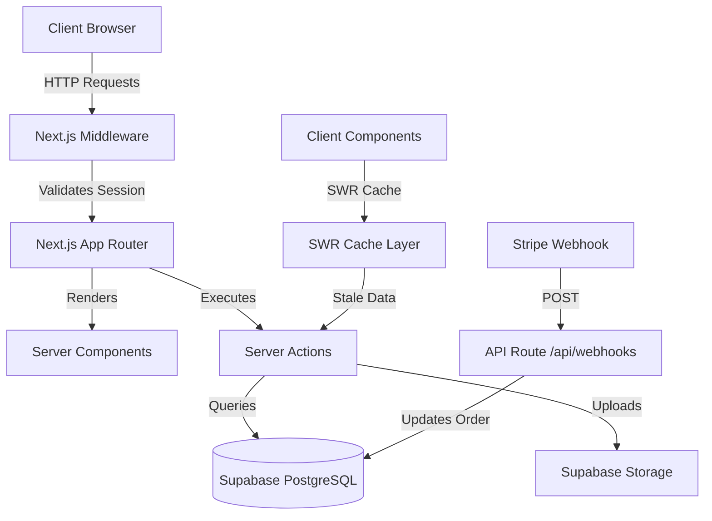

# BoostBuddy MVP

A modern, full-stack Next.js web application designed to manage client profiles, services, orders, and invoices. It features an integrated client and admin dashboard, Stripe checkout, Supabase authentication, and a scalable architecture optimized for high performance.

## Features

### Core Functionality
- **Next.js App Router Architecture**: Leverages Server Components and Server Actions for fast, secure data fetching and mutations
- **Role-Based Authentication**: Secure authentication via Supabase with distinct `ADMIN`, `CLIENT`, and `EMPLOYEE` user roles and protected routes
- **Multi-URL Reviews System**: Clients can create one review with content written once and assign it to multiple URLs (up to 10)
- **Credits System**: Complete credits-based payment system for reviews services with package management, balance tracking, and transaction history
- **Employee Management**: Dedicated employee accounts with availability toggles, performance tracking, order history visibility, and automated order distribution
- **Stripe Integration**: Automated checkout, payment processing, and webhooks for real-time order fulfillment
- **Invoice Management**: Admin panel allows secure uploading of PDF invoices linked directly to client orders via Supabase Storage
- **Unified Notifications**: Multi-channel notification system supporting in-app alerts and Telegram delivery for reviews, orders, and system events
- **Internationalization (i18n)**: Multi-language support (English/Italian) implemented using `react-i18next`
- **SWR Caching**: Intelligent caching strategy for optimal performance across all panels
- **Modern UI/UX**: Built with Tailwind CSS, Base UI components, and fully responsive design

### Recent Enhancements (2024)
- **Order History**: Employees can view their complete order history including current assignments and completed tasks
- **Business Name Removal**: Simplified order details by removing business name field
- **Feedback System Removal**: Streamlined UI by removing client feedback on completed reviews
- **Responsive Design**: All pages fully responsive with mobile-first approach
- **Data Loading Fixes**: Improved error handling and data validation across all panels

---

# Tech Stack

| Technology | Version | Purpose |
|------------|---------|---------|
| **Next.js** | 16.2.9 | Core React Framework (App Router, Server Actions) |
| **React** | 19.2.4 | UI Component Library |
| **TypeScript** | 5.x | Static Typing for robust code quality |
| **Supabase** | ^0.12.0 | Authentication and PostgreSQL DB |
| **TailwindCSS** | 4.3.1 | Utility-first CSS styling framework |
| **Base UI** | (latest) | Accessible, reusable UI component foundation |
| **Stripe** | ^22.2.1 | Payment Gateway for checkouts and webhooks |
| **SWR** | ^2.2.0 | Data fetching and caching library |
| **i18next** | ^26.3.2 | Internationalization framework |

---

# Architecture Overview

The application follows a modern Next.js Serverless Architecture with SWR caching for optimal performance.

### Core Patterns


```mermaid
graph TD
    Client[Client Browser] -->|HTTP Requests| Middleware[Next.js Middleware]
    Middleware -->|Validates Session| AppRouter[Next.js App Router]

    AppRouter -->|Renders| ServerComponents[Server Components]
    AppRouter -->|Executes| ServerActions[Server Actions]

    ServerActions -->|Queries| SupabaseDB[(Supabase PostgreSQL)]
    ServerActions -->|Uploads| SupabaseStorage[Supabase Storage]

    ClientComponents[Client Components] -->|SWR Cache| SWRCache[SWR Cache Layer]
    SWRCache -->|Stale Data| ServerActions

    StripeWebhook[Stripe Webhook] -->|POST| APIRoute[API Route /api/webhooks]
    APIRoute -->|Updates Order| SupabaseDB
```

### Data Fetching Strategy

**Server Components** (Initial Load):
- Use `createClient()` from `lib/supabase/server` directly
- Data fetched server-side for fast initial page loads
- Passed to client components as `initialData` prop

**Client Components** (Interactive Updates):
- Use SWR with server actions as fetchers
- Automatic revalidation when data becomes stale
- Optimistic UI updates for better UX

**Cache Keys** (SWR):
- `CACHE_KEYS.ADMIN_DASHBOARD` - Admin stats (2 min TTL)
- `CACHE_KEYS.ADMIN_REVIEWS` - Reviews overview (2 min TTL)
- `CACHE_KEYS.ADMIN_EMPLOYEE_PERFORMANCE` - Employee stats (2 min TTL)
- `CACHE_KEYS.CLIENT_DASHBOARD` - Client profiles (3 min TTL)
- `CACHE_KEYS.EMPLOYEE_DASHBOARD` - Employee tasks (1 min TTL)
- `CACHE_KEYS.CLIENT_REVIEWS_DASHBOARD` - Reviews dashboard (2 min TTL)

---

# Folder Structure

```text
/
├── app/                          # Next.js App Router (Pages, Layouts, Server Actions)
│   ├── actions/                   # Server Actions (Database mutations)
│   │   ├── admin-reviews.ts      # Admin reviews management
│   │   ├── admin-earnings.ts    # DELETED - Earnings removed
│   │   ├── employee-earnings.ts # DELETED - Earnings removed
│   │   ├── employee-dashboard.ts # Employee dashboard data
│   │   ├── reviews.ts            # Reviews CRUD operations
│   │   ├── reviews-multiurl.ts   # Multi-URL review orders
│   │   └── ...
│   ├── admin/                     # Admin Dashboard Routes
│   │   ├── dashboard/page.tsx     # Admin overview/stats
│   │   ├── reviews/page.tsx       # Reviews management
│   │   ├── reviews/employees/     # Employee performance page
│   │   ├── clients/page.tsx       # Client management
│   │   ├── services/page.tsx     # Services management
│   │   └── ...
│   ├── client/                     # DELETED - Using /c instead
│   ├── c/                          # Client Panel Routes
│   │   ├── dashboard/page.tsx     # Client dashboard
│   │   ├── services/reviews/       # Reviews services
│   │   ├── wallet/                 # Wallet & credits
│   │   ├── payments/               # Payment history
│   │   └── ...
│   ├── e/                          # Employee Panel Routes
│   │   ├── dashboard/page.tsx     # Employee dashboard
│   │   ├── orders/page.tsx        # Order history
│   │   ├── orders/[id]/page.tsx   # Order detail (with task completion)
│   │   ├── pending/page.tsx        # Account pending state
│   │   └── notifications/page.tsx # Notifications
│   ├── api/                       # API Routes (Webhooks, Logout)
│   └── auth/                      # Supabase Auth Callbacks
├── components/                    # Shared React Components
│   ├── ui/                         # Base UI components
│   ├── providers/                  # Context providers
│   ├── reviews/                   # Reviews-specific components
│   └── ...
├── context/                       # React Context (Auth, Toast, Confirm)
├── lib/                           # Utilities and Services
│   ├── auth/                      # Auth helpers
│   ├── supabase/                  # Supabase clients (server, admin, middleware)
│   ├── cache/                     # SWR caching configuration
│   ├── constants.ts               # App-wide constants
│   └── ...
├── locales/                        # Translation files
│   ├── en.json                    # English translations
│   └── it.json                    # Italian translations
├── prisma/                        # Data schema (legacy, using Supabase directly)
└── public/                        # Static assets
```

---

# Database

The application uses Supabase (PostgreSQL) as its primary database.

## Core Tables

### Users & Authentication
| Table | Purpose | Key Fields |
|-------|---------|------------|
| `users` | User accounts, roles, credits | `id`, `email`, `role` (ADMIN/CLIENT/EMPLOYEE), `creditsBalance` |

### Reviews System
| Table | Purpose | Key Fields |
|-------|---------|------------|
| `review_orders` | Client review submissions | `id`, `userId`, `orderType`, `reviewContent`, `photos`, `status`, `totalUrls`, `creditsConsumed` |
| `review_urls` | Individual URLs within orders | `id`, `reviewOrderId`, `url`, `quantity`, `status`, `assignedEmployeeId`, `proofOfCompletion` |
| `employee_stats` | Employee performance tracking | `id`, `userId`, `ordersCompleted`, `lastActiveAt`, `isAvailable` |

### Credits System
| Table | Purpose | Key Fields |
|-------|---------|------------|
| `credit_packages` | Available credit packages | `id`, `credits`, `price`, `EUR` |
| `credit_transactions` | Financial ledger | `id`, `userId`, `type` (PURCHASE/SPEND/REFUND/ADMIN_ADJUST), `amount`, `balanceAfter` |

### Box Services (Legacy)
| Table | Purpose | Key Fields |
|-------|---------|------------|
| `services` | Subscription services (EUR) | `id`, `name`, `price`, `duration` |
| `profile_accounts` | Client profiles (IXBrowser) | `id`, `assignedClientId`, `serviceId` |
| `orders` | Orders (Stripe + Credits) | `id`, `userId`, `serviceId`, `status` (PAID/FAILED) |
| `invoices` | PDF invoices | `id`, `userId`, `orderId`, `fileUrl` |

### System
| Table | Purpose | Key Fields |
|-------|---------|------------|
| `notifications` | In-app + Telegram notifications | `id`, `userId`, `type`, `message`, `read` |

---

# Multi-URL Reviews System

The reviews system was redesigned to support creating one review with content written once and assigning it to multiple URLs.

## Order Types

| Type | Description | Credits | Content Required |
|------|-------------|---------|------------------|
| `REVIEW` | Text reviews on Facebook | 10 per URL | ✅ Review text |
| `COMMENT` | Reactions only (no text) | 5 per URL | ❌ No text |
| `COMMENT_WITH_PHOTO` | Reviews with photo | 20 per URL | ✅ Review + Photo |

## Order Creation Flow

1. **Client Selects Order Type** - Choose from REVIEW, COMMENT, or COMMENT_WITH_PHOTO
2. **Write Review Content** - For REVIEW and COMMENT_WITH_PHOTO types, write content ONCE
3. **Upload Photo** - For COMMENT_WITH_PHOTO, upload ONE photo
4. **Add Multiple URLs** - Add up to 10 URLs with quantities per URL
5. **Credit Validation** - System verifies sufficient credits balance
6. **Submit Order** - Order created with shared content applied to all URLs

## Order Structure

```typescript
{
  orderType: "REVIEW" | "COMMENT" | "COMMENT_WITH_PHOTO",
  reviewContent: string,      // Shared across all URLs (written once)
  photos: string[],             // Shared across all URLs (one upload)
  urls: [
    { url: "https://facebook.com/page1", quantity: 50 },
    { url: "https://facebook.com/page2", quantity: 25 },
    // ... up to 10 URLs
  ]
}
```

## Order States

| Status | Description | Visible To |
|--------|-------------|------------|
| `PENDING` | New order in pool, awaiting assignment | Client, Admin |
| `IN_PROGRESS` | Employee working on tasks | Client, Admin, Employee |
| `COMPLETED` | All URL tasks completed | Client, Admin, Employee |
| `CANCELLED` | Order cancelled by admin | Client, Admin |

## Employee Task Flow

1. **Dashboard View** - Available tasks shown on employee dashboard
2. **Accept Task** - Employee clicks to accept a URL task
3. **View Details** - See the Facebook URL, review content, and requirements
4. **Complete Review** - Post the review on Facebook
5. **Submit Proof** - Submit screenshot URL as proof of completion
6. **Task Completed** - Admin can verify and mark as complete

---

# Employee Performance & Order History

The employee performance page provides admins with visibility into each employee's workload and history.

## Features

- **Order History View**: Expandable sections showing:
  - **Current Assignments**: ASSIGNED and IN_PROGRESS tasks with URLs and quantities
  - **Completed Orders**: COMPLETED tasks with completion dates
- **Real-Time Availability**: Toggle employee availability on/off
- **Task Distribution Control**: Enable/disable task distribution per employee
- **Account Management**: Activate/deactivate employee accounts
- **Performance Stats**: View completed orders count and last active date

## Order Status Display

In the order history, each task shows:
- Task number and URL
- Status badge (ASSIGNED, IN_PROGRESS, COMPLETED)
- Quantity for that URL
- Review content (from shared order content)
- Completion date (if completed)
- Proof of completion (if submitted)

---

# Authentication

## User Roles

| Role | Code | Permissions | Routes |
|------|------|------------|--------|
| **ADMIN** | `ADMIN` | Full system access | `/a/*` |
| **CLIENT** | `CLIENT` | Profile management, Orders, Reviews | `/c/*` |
| **EMPLOYEE** | `EMPLOYEE` | Task acceptance, Completion | `/e/*` |

## Auth Flow

1. **Login/Signup** → Supabase handles credentials
2. **Session Created** → JWT stored in HttpOnly cookie
3. **Middleware Validation** → Every request validated
4. **Route Protection** → Role-based access control
5. **Client Components** → Access user via `useAuth()` hook

## Auth Context

```typescript
const { user, isLoading, signIn, signUp, signOut } = useAuth();
```

Provides global access to:
- `user` - Current user object with role, email, etc.
- `isLoading` - Authentication state
- `signIn()` / `signUp()` - Authentication functions
- `signOut()` - Logout function

---

# Credits System

The Credits System provides a flexible payment alternative to direct EUR purchases for Reviews services.

## Credit Packages

| Credits | Price (EUR) |
|---------|-------------|
| 10 | 1.00 |
| 25 | 2.00 |
| 50 | 3.50 |
| 100 | 6.00 |
| 250 | 12.00 |

## Review Costs

| Order Type | Cost per URL | Notes |
|------------|--------------|-------|
| REVIEW | 10 credits | Text review only |
| COMMENT | 5 credits | Reaction only |
| COMMENT_WITH_PHOTO | 20 credits | Review + photo |

## Transaction Flow

1. **Purchase** → Client buys package via Stripe
2. **Credit** → `PURCHASE` transaction created, balance updated
3. **Spend** → Review order created, `SPEND` transaction created
4. **Balance** → `users.creditsBalance` cached value updated

## Balance Calculation

Balance is always calculated from the ledger (`credit_transactions` table):
```typescript
balance = SUM(credit_transactions.amount WHERE userId = ?)
```

---

# SWR Caching Strategy

SWR (Stale-While-Revalidate) caching is implemented across all panels for optimal performance.

## Cache Configuration

| Panel | Cache Key | TTL | Purpose |
|-------|-----------|-----|---------|
| Admin | `ADMIN_DASHBOARD` | 2 min | Stats, pending clients |
| Admin | `ADMIN_REVIEWS` | 2 min | Reviews overview |
| Admin | `ADMIN_EMPLOYEE_PERFORMANCE` | 2 min | Employee stats, history |
| Client | `CLIENT_DASHBOARD` | 3 min | Profiles, services |
| Client | `CLIENT_REVIEWS_DASHBOARD` | 2 min | Reviews dashboard |
| Client | `CLIENT_WALLET` | 3 min | Balance, transactions |
| Employee | `EMPLOYEE_DASHBOARD` | 1 min | Tasks, stats (frequent) |

## Usage Pattern

```typescript
const { data, refresh, isValid } = useSWR({
  key: CACHE_KEYS.ADMIN_DASHBOARD,
  fetcher: async () => {
    const result = await getAdminDashboardStatsAction();
    if (result.success) return result.data;
    return initialData; // Fallback on error
  },
  ttl: 2 * 60 * 1000, // 2 minutes
  initialData: serverData,
});
```

## Benefits

- **Reduced Server Load**: Caching prevents repeated queries
- **Better UX**: Instant page navigation with cached data
- **Automatic Refresh**: Stale data revalidated in background
- **Offline Support**: Shows cached data during network issues

---

# Installation & Setup

## Prerequisites

- Node.js 18+
- npm or yarn
- Supabase project
- Stripe account

## Environment Variables

Create `.env.local`:

```bash
# Supabase
NEXT_PUBLIC_SUPABASE_URL=your-project-url
NEXT_PUBLIC_SUPABASE_ANON_KEY=your-anon-key
SUPABASE_SERVICE_ROLE_KEY=your-service-role-key

# Stripe
NEXT_PUBLIC_STRIPE_PUBLISHABLE_KEY=your-publishable-key
STRIPE_SECRET_KEY=your-secret-key
STRIPE_WEBHOOK_SECRET=your-webhook-secret

# Telegram (Optional)
TELEGRAM_BOT_TOKEN=your-bot-token
TELEGRAM_CHAT_ID=your-chat-id

# App
NEXT_PUBLIC_SITE_URL=http://localhost:3400
```

## Installation

```bash
# Clone repository
git clone <repository-url>
cd boostbuddy-mvp

# Install dependencies
npm install

# Run development server
npm run dev
```

## Build & Deploy

```bash
# Build for production
npm run build

# Start production server
npm start

# Run linter
npm run lint
```

---

# Development Workflow

## Adding a New Server Action

```typescript
// app/actions/your-action.ts
"use server";

import { requireAuth } from "@/lib/auth/server-auth";
import { createClient } from "@/lib/supabase/server";

export async function yourAction() {
  const auth = await requireAuth();
  if (!auth.success) return auth;

  const supabase = await createClient();

  // Your logic here

  return { success: true, data: result };
}
```

## Adding a New Page Route

```typescript
// app/admin/new-page/page.tsx
import { requireAuth } from "@/lib/auth/server-auth";
import { LoadingScreen } from "@/components/LoadingScreen";

export default async function NewPage() {
  const auth = await requireAuth({ role: 'ADMIN' });
  if (!auth.success) return <LoadingScreen />;

  // Fetch data server-side

  return <div>{/* Your UI */}</div>;
}
```

## Adding Translations

1. Add to `locales/en.json`:
```json
{
  "yourNamespace": {
    "yourKey": "Your English text",
    "yourKey2": "Another text {{variable}}"
  }
}
```

2. Add to `locales/it.json`:
```json
{
  "yourNamespace": {
    "yourKey": "Il tuo testo inglese",
    "yourKey2": "Altro testo {{variable}}"
  }
}
```

3. Use in component:
```typescript
const { t } = useTranslation("yourNamespace");
t("yourKey")
t("yourKey2", { variable: "value" })
```

---

# Best Practices

## Security
- ✅ Always use `requireAuth()` in Server Actions
- ✅ Never expose service role key to client
- ✅ Use `createAdminClient()` sparingly (admin operations only)
- ✅ Validate user input before database operations
- ✅ Use environment variables for secrets

## Performance
- ✅ Use Server Components when possible
- ✅ Implement SWR caching for frequently accessed data
- ✅ Use `useTransition` for optimistic UI updates
- ✅ Lazy load heavy components with dynamic imports
- ✅ Implement proper pagination for large datasets

## UI/UX
- ✅ Mobile-first responsive design
- ✅ Use Tailwind breakpoints (`sm:`, `md:`, `lg:`)
- ✅ Provide loading states and empty states
- ✅ Show meaningful error messages
- ✅ Use toast notifications for user feedback
- ✅ Implement optimistic UI updates

## Code Quality
- ✅ Use TypeScript for type safety
- ✅ Follow ESLint rules
- ✅ Keep functions small and focused
- ✅ Use descriptive variable names
- ✅ Add comments for complex logic
- ✅ Handle errors gracefully

---

# Deployment

## Vercel Deployment

The project is optimized for Vercel deployment:

1. **Push to master** → Auto-triggers build
2. **Environment Variables** → Configure in Vercel dashboard
3. **Build Output** → Serverless Functions + Static pages
4. **Edge Functions** → Middleware runs on edge

## Build Optimization

- Static pages pre-rendered at build time
- Serverless Functions for dynamic routes
- Automatic code splitting
- Tree-shaking removes unused code
- Asset optimization (images, CSS, JS)

---

# Panel Routes

## Admin Panel (`/a/*`)

| Route | Purpose | Key Features |
|------|---------|--------------|
| `/a/dashboard` | Admin overview | Stats, pending clients, expiring profiles |
| `/a/reviews` | Reviews overview | Total orders, pending, in progress, completed stats |
| `/a/reviews/employees` | Employee management | Performance stats, order history, availability |
| `/a/clients` | Client management | List, search, activate/deactivate |
| `/a/orders` | Order management | Filter, search, order details |
| `/a/services` | Service management | Pricing, duration, manage services |
| `/a/invoices` | Invoice management | Upload, link to orders |
| `/a/notifications` | Notification logs | View all sent notifications |

## Client Panel (`/c/*`)

| Route | Purpose | Key Features |
|------|---------|--------------|
| `/c/dashboard` | Client dashboard | Assigned profiles, expiring soon |
| `/c/services/reviews` | Reviews hub | Create orders, view history |
| `/c/services/reviews/orders` | Order list | Filter by status, pagination |
| `/c/services/reviews/orders/[id]` | Order details | View status, URLs, content |
| `/c/services/reviews/new-order` | Create order | Multi-URL form with content sharing |
| `/c/wallet` | Wallet | Balance, purchase credits, view packages |
| `/c/wallet/transactions` | Transaction history | Filter by type, pagination |
| `/c/payments` | Payment history | View Stripe payments |
| `/c/invoices` | Invoice history | Download linked invoices |
| `/c/notifications` | Notifications | Expiration alerts, order updates |

## Employee Panel (`/e/*`)

| Route | Purpose | Key Features |
|------|---------|--------------|
| `/e/dashboard` | Employee dashboard | Available tasks, stats, toggle availability |
| `/e/orders` | Order history | View all assigned orders |
| `/e/orders/[id]` | Order detail | Accept task, view content, submit proof |
| `/e/notifications` | Notifications | Order updates, system alerts |
| `/e/pending` | Pending state | Shows when account not active |

---

# Troubleshooting

## Common Issues

### Auth Cookies Not Persisting
- **Issue**: Users repeatedly logged out
- **Fix**: Ensure `NEXT_PUBLIC_SITE_URL` matches deployment domain exactly

### Build Errors on Vercel
- **Issue**: TypeScript errors during build
- **Fix**: Run `npm run lint` locally before pushing

### Data Not Loading
- **Issue**: Pages showing empty data
- **Check**: Server action returns success
- **Check**: SWR cache key matches
- **Check**: User has correct role

### Stripe Webhook Failures
- **Issue**: Orders not updating after payment
- **Fix**: Verify `STRIPE_WEBHOOK_SECRET` matches Stripe dashboard
- **Fix**: Check webhook endpoint is accessible

---

# API Documentation

## Server Actions

Most data logic is handled by Next.js Server Actions in `app/actions/`:

### Reviews Actions
- `createMultiUrlReviewOrderAction()` - Create review with multiple URLs
- `getReviewOrderDetailAction(orderId)` - Get order details
- `getClientReviewOrdersAction()` - Get client's orders
- `submitUrlTaskCompletionAction()` - Employee submits task proof
- `acceptUrlTaskAction(taskId)` - Employee accepts task

### Admin Actions
- `getReviewsOverviewAction()` - Reviews overview stats
- `getEmployeePerformanceAction()` - Employee performance data
- `getEmployeeAssignedReviewsAction(userId)` - Employee order history
- `inviteEmployeeAction()` - Invite new employee
- `setEmployeeActiveStatusAction()` - Activate/deactivate employee

### Client Actions
- `getReviewsDashboardAction()` - Reviews dashboard data
- `getWalletSummaryAction()` - Wallet balance and transactions
- `purchaseCreditsAction()` - Initiate Stripe checkout

### Employee Actions
- `getEmployeeDashboardDataAction()` - Dashboard tasks and stats
- `toggleTaskDistributionAction()` - Enable/disable task receiving
- `getEmployeeOrderHistoryAction()` - Employee's order history

## API Routes

### Stripe Webhook
- **Endpoint**: `POST /api/webhooks/stripe`
- **Purpose**: Process payment events, activate services
- **Auth**: Stripe webhook signature

### Logout
- **Endpoint**: `POST /api/logout`
- **Purpose**: Clear session cookies
- **Auth**: None required

---

# License

Proprietary - All rights reserved

---

# Support

For technical support or questions, contact the development team.
